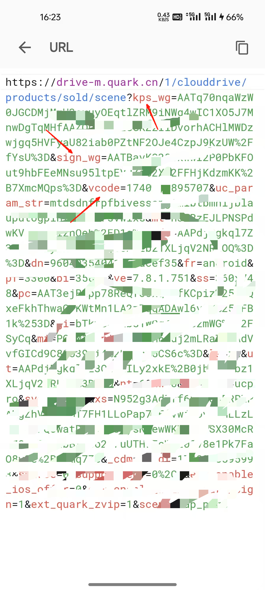
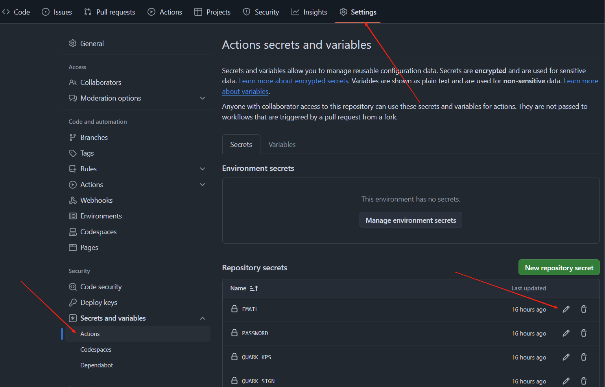

# 夸克自动签到

## 配置

抓包流程：
【手机端】

1. 打开[reqable](https://reqable.com/zh-CN/)抓包工具，手机端访问签到页
2. 搜索找到域名 https://drive-m.quark.cn 的请求信息
   
3. 复制url后面的参数: kps sign vcode并设置到环境变量中
   

## 配置环境变量

### 必要配置

|    抓包的参数    |      说明      |
|:-----------:|:------------:|
|  QUARK_KPS  | 抓包参数的kps_wg  |
| QUARK_SIGN  | 抓包参数的sign_wg |
| QUARK_VCODE |  抓包参数的vcode  |

### 可选配置

|   邮件通知配置    |    说明     |
|:-----------:|:---------:|
| SMTP_SERVER | smtp服务器地址 |
|  SMTP_PORT  |   服务器端口   |
|    EMAIL    |  接收通知的邮箱  |
|  PASSWORD   |  邮箱的授权码   |

## Github Actions自动签到配置

## 参考开源项目

[Auto_Check_In](https://github.com/BNDou/Auto_Check_In/blob/main/checkIn_Quark.py)